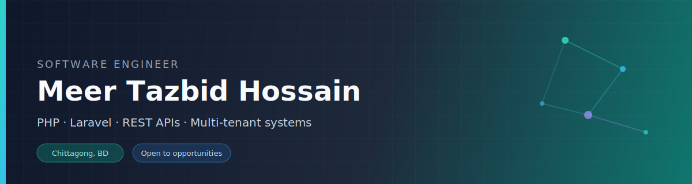
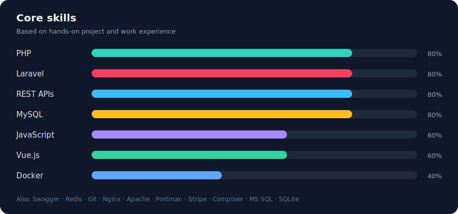
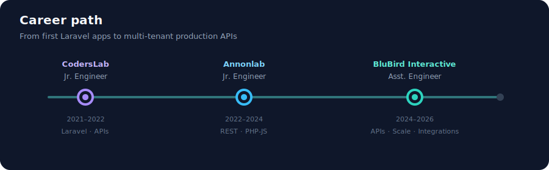

  

 

**Backend-focused Software Engineer** with hands-on experience building REST APIs, multi-tenant platforms, and business web apps using **PHP** and **Laravel**.

I care about clear APIs, safe data handling between tenants, and systems that stay reliable in production.

  
  
  
  

---

## Skills at a glance

  

---

## How multi-tenant systems fit together

This is a simple picture of the kind of backend I have worked on — several clients (tenants) share one application, but their data stays separated.

  

**In plain words:**  
Users from different companies hit the same Laravel API. The app checks who they are, then reads/writes only their own data in MySQL. Redis helps with speed and background jobs. Swagger documents the API so other developers can use it safely.

---

## Career path

  

| When | Where | What I did |
|------|--------|------------|
| Aug 2024 – May 2026 | **BluBird Interactive Ltd.** · Assistant Software Engineer | Improved REST APIs, fixed bugs, optimized performance, integrated third-party services |
| Jun 2022 – Aug 2024 | **Annonlab** · Junior Software Engineer | Built REST APIs, supported frontend bug fixing, maintained a PHP–JS (XML API) project |
| Apr 2021 – Apr 2022 | **CodersLab** · Junior Software Engineer (part-time) | Built Laravel + Blade apps and JSON APIs |

---

## Selected projects

<table>
  <tr>
    <td width="50%" valign="top">
      <h3>🏠 Real Estate Management System</h3>
      
<b>For:</b> US-based client 
      <b>Stack:</b> Laravel · MySQL

      
Multi-tenant, multi-database platform for real estate operations. Focused on performance, <b>data isolation between tenants</b>, and reliable backend APIs.

    </td>
    <td width="50%" valign="top">
      <h3>💵 Payslip Generation App</h3>
      
<b>For:</b> French client 
      <b>Stack:</b> Laravel · MySQL · Vue.js

      
Payslip and salary slip system with accurate payroll processing. Backend APIs in Laravel; user-friendly frontend in Vue.js.

    </td>
  </tr>
  <tr>
    <td width="50%" valign="top">
      <h3>🎮 CS:GO Skins Marketplace</h3>
      
<b>Role:</b> Freelance team member 
      <b>Stack:</b> Laravel · MySQL · Swagger

      
Marketplace backend for trading skins via bots. Built APIs and <b>Swagger docs</b> so frontend developers could integrate faster.

    </td>
    <td width="50%" valign="top">
      <h3>🏥 Clinic & more</h3>
      
<b>Stack:</b> Laravel · PHP · JS · MySQL

      
<b>Clinic Management</b> — 20+ modules for healthcare workflows. 
      <b>Day-care system</b> — activities, contracts, pricing (PHP, jQuery, MySQL). 
      <b>Email marketing</b> — maintenance with PHP, JS, MySQL.

    </td>
  </tr>
</table>

---

## Education

**B.Sc. in Computer Science and Engineering**  
International Islamic University Chittagong · 2018 – 2022 · CGPA 3.44

---

## Get in touch

I'm open to **Software Engineer** roles — especially backend, Laravel, and API-focused work.

| | |
|:--|:--|
| 🌐 Portfolio | [tazbid.github.io](https://tazbid.github.io) |
| 💼 LinkedIn | [tazbid-hossain](https://www.linkedin.com/in/tazbid-hossain-259854207/) |
| ✉️ Email | [tazbidhossain@gmail.com](mailto:tazbidhossain@gmail.com) |
| 💻 GitHub | [github.com/tazbid](https://github.com/tazbid) |
